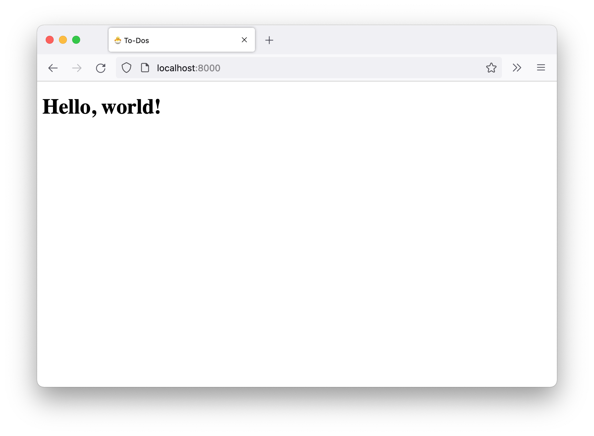

# Getting started with Cav

These docs assume you're a TypeScript developer with some experience using Deno
and Preact.

I suggest leaving your right-click menu at home. Typing everything manually aids
the learning process, and it's how Cav is intended to be used. You can expand
the "⚡️ Breakdown" drop-downs to get a closer look at what's happening.

To start, we're going to do To-Dos. (It's tradition.)

- [Getting started with Cav](#getting-started-with-cav)
  - [0. Install Deno](#0-install-deno)
  - [1. Greet the world](#1-greet-the-world)
  - [2. Design the interface](#2-design-the-interface)
  - [3. Build the interface](#3-build-the-interface)
  - [4. API the business logic](#4-api-the-business-logic)
  - [5. Pipe the data](#5-pipe-the-data)
  - [6. Attach a database](#6-attach-a-database)
  - [7. Authenticate users](#7-authenticate-users)
  - [8. Push to production](#8-push-to-production)

## 0. Install Deno

Cav needs [Deno](https://deno.land). Install v1.20 or higher.

If you're using [Visual Studio Code](https://code.visualstudio.com/) as your IDE, install the [vscode_deno extension](https://marketplace.visualstudio.com/items?itemName=denoland.vscode-deno).

## 1. Greet the world

Create a new folder for the project. (This folder will be referred to as
`<root>/` moving forward.)

If you're using Visual Studio Code, create a `.vscode/` folder in `<root>/` and
put a `settings.json` file in there with the following JSON. (Why? [Click
here.](https://deno.land/manual@v1.20.1/vscode_deno#deno-enabling-a-workspace))

```json
{
  // <root>/.vscode/settings.json (don't include this line)
  "deno.enable": true,
  "deno.lint": true
}
```

Create a `main.ts` file in the project `<root>/`, which will be the entrypoint
for the server. Pop this code in there:

```ts
#!/usr/bin/env deno run --watch --allow-net --allow-read

// <root>/main.ts
import {
  assets,
  serve,
  stack,
} from "https://deno.land/x/cav/mod.ts";

const mainStack = stack({
  "*": assets({
    cwd: import.meta.url,
  }),
});

serve(mainStack);
console.log("Listening on port 8000");
```

<details><summary>⚡️ Breakdown</summary>

TODO lol

</details>

Now go to your terminal and make that file executable. This lets you easily
start the server with the command `./main.ts`.

```sh
> chmod +x main.ts
```

Next, create an `assets/` folder in `<root>/`, and put an `index.html` file in
it. This will be the landing page. Keep it minimal for now:

```html
<!DOCTYPE html>
<html lang="en"><head>

  <!-- <root>/assets/index.html -->
  <meta charset="utf-8">
  <title>🥚 To-Dos</title>

</head><body>

  <h1>Hello, world!</h1>

</body></html>
```

Drink some water and let your baby gestate for a few minutes. When you're good
and ready, start the server from the terminal and point your browser to
http://localhost:8000.

```sh
> ./main.ts
# ... Deno stuff ...
Listening on port 8000
```



Pat yourself on the back for surviving a gestating-baby joke. You did it! 🥳

## 2. Design the interface

(If you're like me, this is the hardest step to get through. Have yourself a
good cry and psych up for the brutal cost-to-benefit ratio that's barrelling
your way. Don't let it catch you off guard... *it can smell fear.*)

Create a wireframe for the interface using your favorite design software. I'm no
designer, but [Figma](https://figma.com) doesn't care. Below is a video of me
using it to make a really basic prototype. (I sped it up to 1.5x because I'm a
Figma noob. Gotta start somewhere, eh?)

## 3. Build the interface

## 4. API the business logic

## 5. Pipe the data

## 6. Attach a database

## 7. Authenticate users

## 8. Push to production